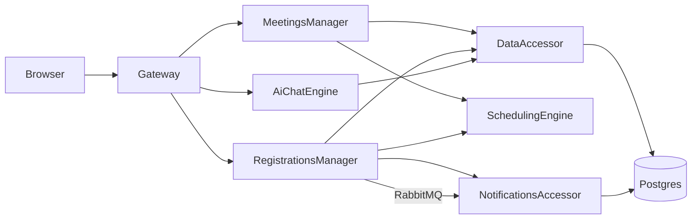

# MeetingFlow.Microservices

ASP.NET Core minimal-API microservices following the **IDesign method** (Manager / Engine / Resource Accessor), running on Docker Compose with Postgres and RabbitMQ.

## Architecture

```
MeetingFlow.Microservices/
├── docker-compose.yml                          # 10 containers: Postgres, RabbitMQ, 6 services, Web
├── infra/postgres/init.sql                     # Creates 4 Postgres schemas
│
├── src/
│   ├── Gateway/                                # Public HTTP edge (Client role)
│   │   ├── Program.cs                          # Routes requests to Managers
│   │   ├── Clients/                            # HTTP clients for Managers + AiChatEngine
│   │   │   ├── MeetingsManagerClient.cs
│   │   │   ├── RegistrationsManagerClient.cs
│   │   │   └── AiChatEngineClient.cs
│   │   └── Models/                             # Redeclared entity models (Meeting, Registration)
│   │
│   ├── Managers/
│   │   ├── MeetingsManager/                    # Meeting/session/speaker use cases (Manager)
│   │   │   ├── Program.cs                      # Orchestrates DataAccessor + SchedulingEngine
│   │   │   ├── Clients/                        # HTTP clients for DataAccessor, SchedulingEngine
│   │   │   └── Models/                         # Redeclared entity models
│   │   │
│   │   └── RegistrationsManager/               # Registration + feedback use cases (Manager)
│   │       ├── Program.cs                      # Orchestrates DataAccessor + SchedulingEngine + Notifications
│   │       ├── Clients/                        # HTTP clients for DataAccessor, SchedulingEngine, Notifications
│   │       ├── Models/                         # Redeclared entity models
│   │       ├── Pricing/                        # Inline ticket pricing logic
│   │       └── Messaging/                      # RabbitMQ event publisher
│   │
│   ├── Engines/
│   │   ├── SchedulingEngine/                   # Pure conflict + capacity logic, no DB (Engine)
│   │   │   ├── Program.cs                      # Stateless scheduling checks
│   │   │   └── Models/                         # Redeclared entity models (Session, Meeting)
│   │   │
│   │   └── AiChatEngine/                       # AI-powered chat assistant (Engine)
│   │       ├── Program.cs                      # Chat endpoint with action execution
│   │       ├── Clients/                        # HTTP client for DataAccessor
│   │       └── Services/                       # OpenAI + rule-based chat implementations
│   │
│   ├── Accessors/
│   │   ├── DataAccessor/                       # EF Core over meetings/registrations/feedback (Resource Accessor)
│   │   │   ├── Program.cs                      # CRUD endpoints for all data
│   │   │   ├── Data/                           # DbContext + SeedData
│   │   │   ├── Models/                         # Canonical entity models
│   │   │   └── Repositories/                   # Repository pattern over EF Core
│   │   │
│   │   └── NotificationsAccessor/              # Notifications schema + fake SMTP (Resource Accessor)
│   │       ├── Program.cs                      # Notification CRUD + send endpoint
│   │       ├── Data/                           # DbContext + SeedData
│   │       ├── Models/                         # Redeclared Attendee, Meeting, Notification
│   │       ├── Infrastructure/                 # FakeSmtpGateway
│   │       └── Messaging/                      # RabbitMQ event consumer
│   │
│   └── Web/                                    # Static frontend served by nginx
│       ├── Dockerfile
│       ├── index.html
│       └── nginx.conf
```

### IDesign Roles

| Role                  | Service               | Responsibility                                                         |
| --------------------- | --------------------- | ---------------------------------------------------------------------- |
| **Client**            | Gateway               | Public HTTP edge — routes to Managers                                  |
| **Manager**           | MeetingsManager       | Meeting/session/speaker orchestration                                  |
| **Manager**           | RegistrationsManager  | Registration + feedback orchestration, pricing                         |
| **Engine**            | SchedulingEngine      | Pure logic — conflict detection, capacity checks                       |
| **Engine**            | AiChatEngine          | AI chat with action execution                                          |
| **Resource Accessor** | DataAccessor          | EF Core CRUD over Postgres (meetings, registrations, feedback schemas) |
| **Resource Accessor** | NotificationsAccessor | Notification persistence + fake email sending                          |

### Tech Stack

- **ASP.NET Core 9** — Minimal APIs in each service
- **EF Core** — Npgsql (Postgres) provider
- **PostgreSQL 16** — shared instance with 4 schemas
- **RabbitMQ** — async event publishing (registration.created)
- **Docker Compose** — container orchestration
- **Microsoft.Extensions.AI** — AI chat abstraction (OpenAI / rule-based fallback)

## Service Communication



All inter-service communication is **synchronous HTTP** (via typed `HttpClient`s), except `RegistrationsManager → NotificationsAccessor` which also publishes a `registration.created` event to **RabbitMQ**.

## Database Schemas

The shared Postgres instance has 4 schemas created by `infra/postgres/init.sql`:

| Schema          | Owner Service         | Tables                               |
| --------------- | --------------------- | ------------------------------------ |
| `meetings`      | DataAccessor          | Meetings, Sessions, Speakers, Venues |
| `registrations` | DataAccessor          | Registrations, Attendees             |
| `feedback`      | DataAccessor          | Feedback                             |
| `notifications` | NotificationsAccessor | Notifications                        |

Tables are created by EF Core `EnsureCreated()` at service startup. Seed data is loaded automatically.

## Public REST Endpoints (Gateway, port 8080)

| Method | Path                                    | Description                                   |
| ------ | --------------------------------------- | --------------------------------------------- |
| GET    | `/meetings`                             | List meetings (full entity graph)             |
| GET    | `/meetings/{id}`                        | Meeting details with sessions/registrations   |
| PUT    | `/meetings/{id}`                        | Update meeting (accepts full entity)          |
| GET    | `/admin/meetings`                       | Admin view — no auth, exposes internal fields |
| GET    | `/speakers`                             | List all speakers                             |
| GET    | `/speakers/{id}`                        | Speaker profile including email and phone     |
| POST   | `/registrations`                        | Create registration (accepts full entity)     |
| GET    | `/registrations/by-meeting/{meetingId}` | Registrations with full attendee data         |
| POST   | `/feedback`                             | Submit feedback (accepts full entity)         |
| POST   | `/chat`                                 | AI chat with action execution                 |

Individual services also expose their own ports for debugging: DataAccessor (`5010`), NotificationsAccessor (`5011`), SchedulingEngine (`5020`), MeetingsManager (`5030`), RegistrationsManager (`5031`), AiChatEngine (`5040`).

## Main Flows

### 1. List Meetings

`Browser → Gateway GET /meetings → MeetingsManager GET /meetings → DataAccessor GET /data/meetings → Postgres`

The DataAccessor loads `Meetings` with Venue and Sessions via EF Core. The full entity graph passes unchanged through every layer back to the browser.

### 2. Create Registration

```
Browser → Gateway POST /registrations
  → RegistrationsManager POST /registrations
    → DataAccessor GET /data/meetings/{id}          (fetch meeting for capacity)
    → DataAccessor GET /data/attendees/{id}         (fetch attendee)
    → DataAccessor GET /data/registrations/by-meeting/{id}  (count existing)
    → SchedulingEngine POST /scheduling/check-capacity      (verify room)
    → InlineTicketPricing.CalculatePrice(meeting, registration)
    → DataAccessor POST /data/registrations         (persist)
    → RabbitMQ publish "registration.created"        (async event)
    → NotificationsAccessor POST /notifications/send (direct call)
```

The RegistrationsManager orchestrates 5+ downstream calls, passes full entity objects between services, runs inline pricing, publishes an event, and calls notifications directly.

### 3. Submit Feedback

`Browser → Gateway POST /feedback → RegistrationsManager POST /feedback → DataAccessor POST /data/feedback → Postgres`

Accepts the full `Feedback` entity including `ModerationNotes`.

### 4. Schedule Conflict Check

`MeetingsManager POST /meetings/{id}/sessions/check → DataAccessor GET /data/meetings/{id}/sessions → SchedulingEngine POST /scheduling/check-conflict`

The SchedulingEngine receives full `Session` entities but only uses `RoomName`, `StartsAt`, `EndsAt`.

### 5. Capacity Check

`RegistrationsManager → SchedulingEngine POST /scheduling/check-capacity`

Receives a `CapacityCheckCommand` with a full `Meeting` entity, venue capacity int, and current registration count int — only the two ints are actually needed.

### 6. Send Notification

`RegistrationsManager → NotificationsAccessor POST /notifications/send`

Receives a `SendNotificationCommand` with complete `Attendee` and `Meeting` entities just to extract email and title.

### 7. AI Chat

`Browser → Gateway POST /chat → AiChatEngine POST /chat → (optionally) DataAccessor for data retrieval/action execution`

The AiChatEngine processes the user message, optionally executes actions (list meetings, create/complete/delete tasks), and returns a reply.

## Running

```bash
docker compose up --build
```

Postgres starts first (with a healthcheck), then accessors, engine, managers, and gateway. Schemas are created via `infra/postgres/init.sql` and EF `EnsureCreated` produces the tables. Seed data is loaded automatically on first start.

The web UI is available at `http://localhost:3000`, the Gateway API at `http://localhost:8080`.

## What's Intentionally Wrong

- Each service redeclares its own `Meeting`, `Session`, `Attendee`, `Registration` — drift is silent
- EF Core entities are returned directly from every service, all the way to the public gateway
- Internal fields (`InternalNotes`, `AdminOnlyCode`, `InternalPaymentReference`, `RawPayloadJson`) leak to the public HTTP response
- `POST /registrations` accepts the full entity, letting the client set `PaymentStatus` and `InternalPaymentReference`
- `SchedulingEngine` and `NotificationsAccessor` receive full entities when they only need a few fields
- `RegistrationsManager` runs inline pricing logic on a full `Meeting` it fetched just for capacity
- The Gateway is a passthrough — no edge models, no response shaping
- `/admin/meetings` is reachable without authentication
- No payload versioning between services
- No shared contracts library
